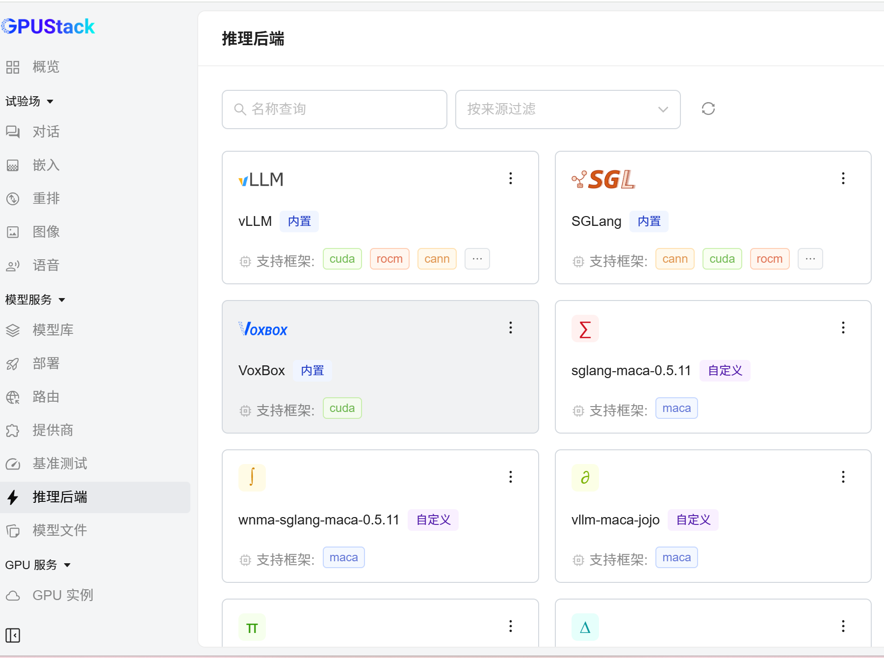
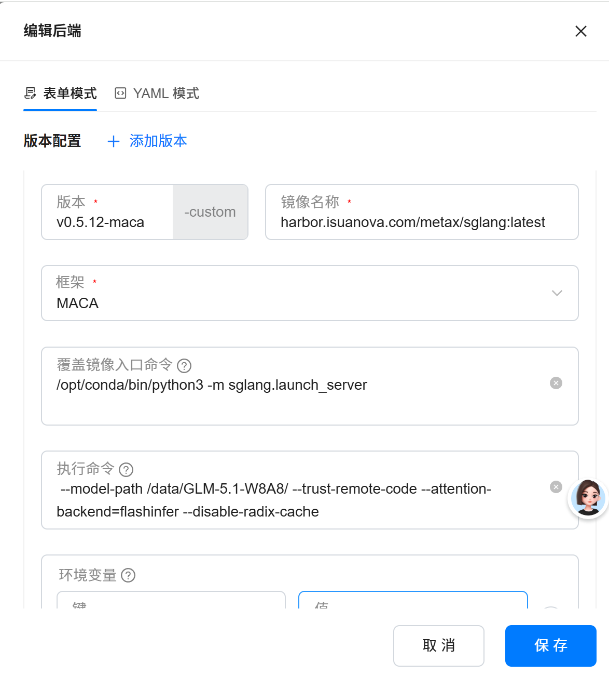
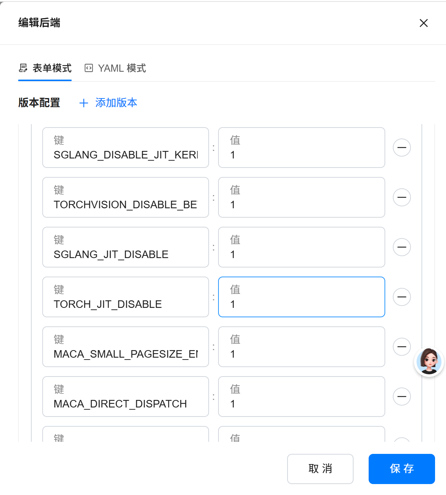
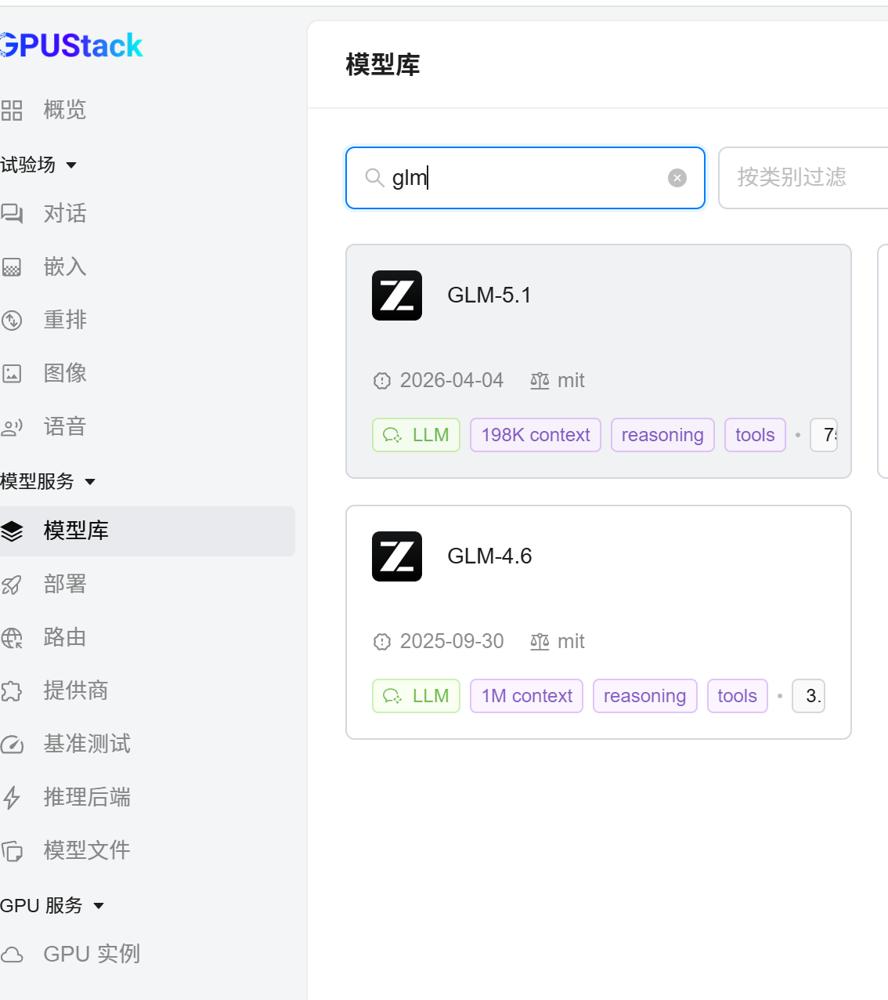
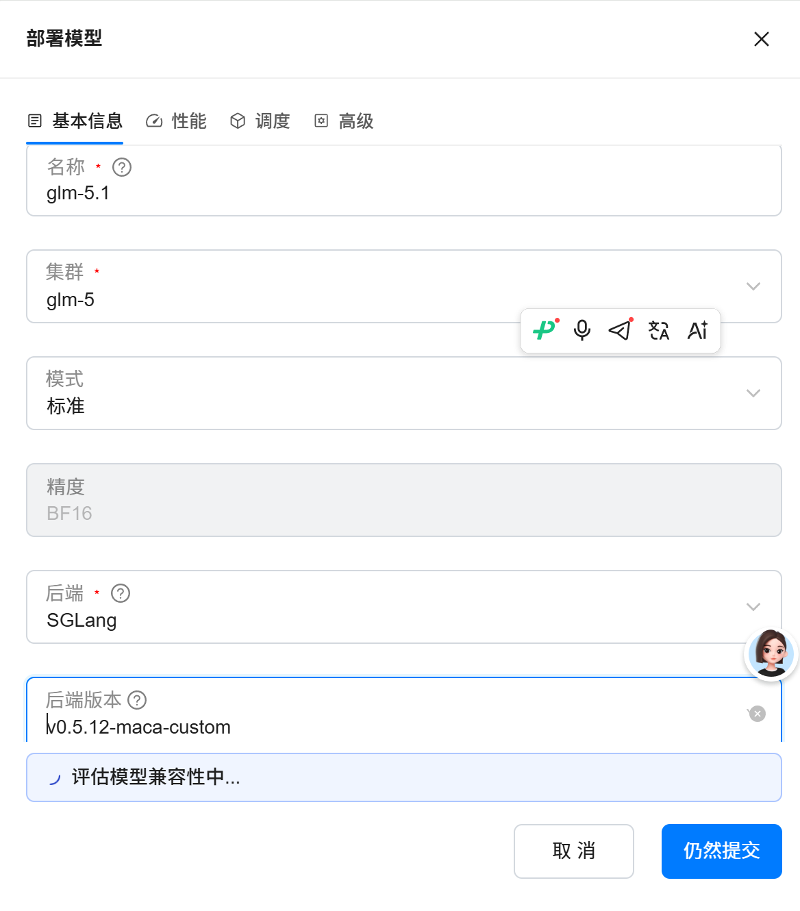
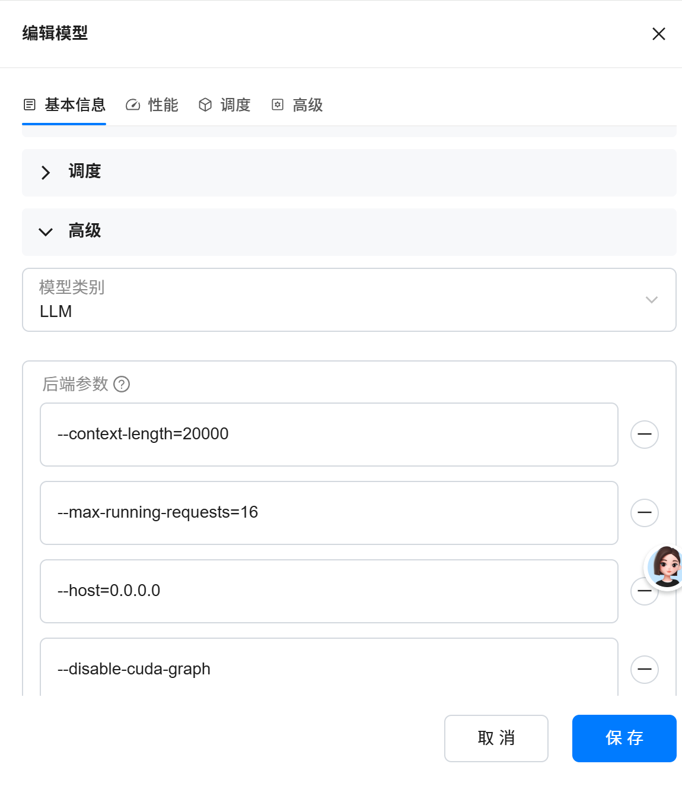
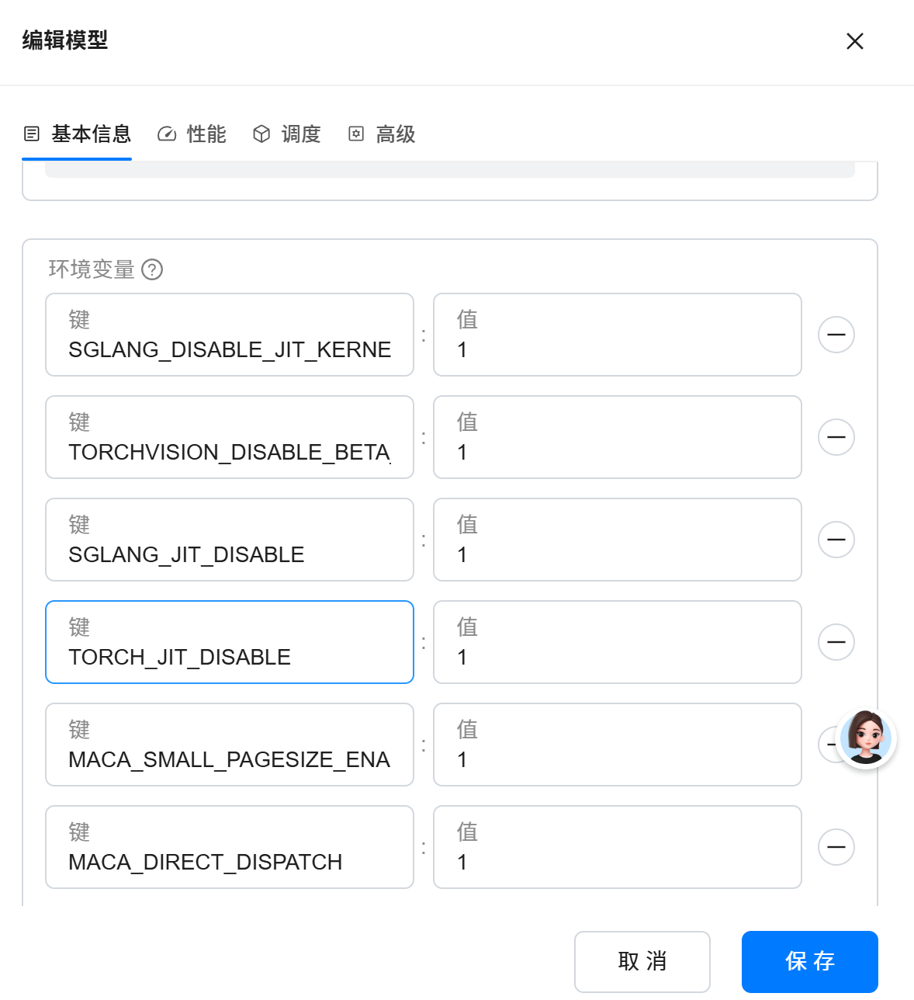

# GPUStack 自定义 SGLang 后端版本配置与大模型部署指南

## 目录

- [1. GPUStack 架构概述](#1-gpustack-架构概述)
- [2. 多节点集群部署原理](#2-多节点集群部署原理)
- [3. 添加自定义 SGLang 后端版本](#3-添加自定义-sglang-后端版本)
- [4. 大模型部署实操](#4-大模型部署实操)
- [5. 常见问题与排查](#5-常见问题与排查)

---

## 1. GPUStack 架构概述

GPUStack 是一个开源的 GPU 集群管理平台，用于统一管理和调度多节点 GPU 资源，实现大模型的高效推理部署。其核心架构由以下组件构成：

### 1.1 核心组件

| 组件 | 说明 |
|------|------|
| **Server** | 管理控制面，提供 Web UI 和 API，负责集群调度和模型分配 |
| **Worker Node** | 每个物理节点上运行的代理进程，负责上报 GPU 资源并执行推理任务 |
| **Inference Engine** | 实际执行推理的引擎（如 SGLang、vLLM 等），以容器方式运行 |

### 1.2 工作流程

```
┌─────────────────────────────────────────────────────────┐
│                    GPUStack Server                       │
│              (管理控制面 + Web UI + API)                  │
└──────────┬──────────────────────────────┬────────────────┘
           │                              │
           ▼                              ▼
┌──────────────────────┐     ┌──────────────────────┐
│    Worker Node 1     │     │    Worker Node 2     │
│  ┌──────────────┐    │     │  ┌──────────────┐    │
│  │  SGLang 容器  │◄───┼─────┼──│  SGLang 容器  │    │
│  │  (主节点)     │    │     │  │  (工作节点)   │    │
│  └──────────────┘    │     │  └──────────────┘    │
│  GPU: 8x H800       │     │  GPU: 8x H800       │
└──────────────────────┘     └──────────────────────┘
           │                              │
           ▼                              ▼
┌──────────────────────┐     ┌──────────────────────┐
│    Worker Node 3     │     │    Worker Node 4     │
│  ┌──────────────┐    │     │  ┌──────────────┐    │
│  │  SGLang 容器  │    │     │  │  SGLang 容器  │    │
│  │  (工作节点)   │    │     │  │  (工作节点)   │    │
│  └──────────────┘    │     │  └──────────────┘    │
│  GPU: 8x H800       │     │  GPU: 8x H800       │
└──────────────────────┘     └──────────────────────┘
```

> 📌 **关键概念**：Worker Node 是每个物理节点在 GPUStack 集群中的"代理人"，负责接收 Server 的调度指令，在本地启动推理容器。

---

## 2. 多节点集群部署原理

### 2.1 集群创建与 Worker 注册

1. **创建集群**：在 GPUStack 中创建一个 Cluster（如 `glm5` 集群）
2. **注册 Worker**：在每个物理节点上启动 Worker 进程，Worker 自动向 Server 注册并上报 GPU 资源信息
3. **资源调度**：Server 掌握全集群 GPU 资源视图，当部署模型时自动选择合适的节点

### 2.2 多节点 SGLang 推理集群的形成

当在 GPUStack 上部署一个大模型（例如 GLM-5.1-W8A8）到某个集群时，GPUStack 会：

1. **选择主节点**：自动（或手动指定）选择一个节点作为 SGLang 主节点
2. **启动容器**：在每个选中的节点上，Worker 会启动一个 SGLang 容器
3. **组成集群**：其他节点上的 SGLang 容器通过 `--dist-init-addr` 参数加入主节点，形成分布式推理集群

> 
>
> *图：GPUStack 多节点集群架构 — Worker 节点在各物理机上运行，SGLang 容器由 Worker 调度启动*

### 2.3 SGLang 启动命令详解

以部署 GLM-5.1-W8A8 为例，GPUStack 会在每个节点上启动如下命令：

```bash
/opt/conda/bin/python3 -m sglang.launch_server \
  --model-path /data/GLM-5.1-W8A8/ \
  --trust-remote-code \
  --attention-backend=flashinfer \
  --disable-radix-cache \
  --tp-size 8 \
  --pp-size 4 \
  --enable-metrics \
  --uvicorn-access-log-exclude-prefixes /metrics \
  --enable-cache-report \
  --nnodes 4 \
  --node-rank 0 \
  --dist-init-addr 10.66.1.168:40057 \
  --context-length 20000 \
  --max-running-requests 16 \
  --host 0.0.0.0 \
  --disable-cuda-graph \
  --dist-timeout 600 \
  --port 40063
```

**参数说明：**

| 参数 | 说明 |
|------|------|
| `--model-path` | 模型文件在本地磁盘的路径，每个节点都需要预下载模型 |
| `--trust-remote-code` | 允许执行模型仓库中的自定义代码 |
| `--attention-backend=flashinfer` | 使用 FlashInfer 注意力后端，提升推理性能 |
| `--disable-radix-cache` | 禁用 Radix Cache（前缀缓存），某些模型架构需禁用 |
| `--tp-size 8` | Tensor Parallelism 并行度，将单个层的计算切分到 8 张 GPU |
| `--pp-size 4` | Pipeline Parallelism 并行度，将模型按层切分到 4 个节点 |
| `--nnodes 4` | 参与分布式推理的节点总数 |
| `--node-rank 0` | 当前节点的排名编号，主节点为 0 |
| `--dist-init-addr 10.66.1.168:40057` | 分布式初始化地址（主节点 IP:Port），其余节点通过此地址加入集群 |
| `--context-length 20000` | 最大上下文长度 |
| `--max-running-requests 16` | 最大同时运行的请求数 |
| `--disable-cuda-graph` | 禁用 CUDA Graph（某些量化模型需要） |
| `--dist-timeout 600` | 分布式通信超时时间（秒） |
| `--port 40063` | SGLang 服务监听端口 |

> ⚠️ **注意**：`--node-rank` 在每个节点上不同，主节点为 `0`，其余节点依次递增（1, 2, 3...）。`--dist-init-addr` 在所有节点上保持一致，指向主节点的 IP 和端口。

### 2.4 分布式推理工作流

```
┌─────────────── Node 0 (主节点, node-rank=0) ───────────────┐
│  SGLang Server 监听 0.0.0.0:40063                          │
│  分布式初始化地址: 10.66.1.168:40057                        │
│  TP: 8 GPUs (同一节点内)                                    │
│  PP: 层段 1/4                                              │
└────────────────────────────┬────────────────────────────────┘
                             │
              --dist-init-addr 10.66.1.168:40057
                             │
┌─────────────── Node 1 (node-rank=1) ──────────────────────┐
│  通过 dist-init-addr 加入主节点                             │
│  TP: 8 GPUs                                                │
│  PP: 层段 2/4                                              │
└────────────────────────────┬────────────────────────────────┘
                             │
┌─────────────── Node 2 (node-rank=2) ──────────────────────┐
│  通过 dist-init-addr 加入主节点                             │
│  TP: 8 GPUs                                                │
│  PP: 层段 3/4                                              │
└────────────────────────────┬────────────────────────────────┘
                             │
┌─────────────── Node 3 (node-rank=3) ──────────────────────┐
│  通过 dist-init-addr 加入主节点                             │
│  TP: 8 GPUs                                                │
│  PP: 层段 4/4                                              │
└────────────────────────────────────────────────────────────┘

总计: 4 节点 × 8 GPU = 32 GPU
TP=8, PP=4 → 8×4=32 GPU 全部参与
```

---

## 3. 添加自定义 SGLang 后端版本

GPUStack 默认提供内置的 SGLang 推理引擎镜像。但在实际使用中，您可能需要：

- 使用特定版本的 SGLang（包含新功能或 bug 修复）
- 使用自定义编译的 SGLang（针对特定硬件或模型优化）
- 在默认镜像中添加自定义依赖包

### 3.1 前置准备

#### 3.1.1 确认当前默认版本

在 GPUStack Web UI 中，进入 **Settings → Inference Engines** 页面，查看当前 SGLang 引擎的默认版本信息：



*图：在 Settings 页面查看当前 SGLang 引擎的默认镜像和版本*

#### 3.1.2 准备自定义镜像

基于 GPUStack 官方 SGLang 镜像进行自定义修改：

```bash
# 拉取官方镜像作为基础
docker pull gpustack/sglang:latest

# 查看镜像信息
docker inspect gpustack/sglang:latest | grep -A5 "Labels"
```

### 3.2 构建自定义 SGLang 镜像

#### 3.2.1 方式一：基于官方镜像修改

创建 `Dockerfile`：

```dockerfile
FROM gpustack/sglang:latest

# 示例：安装特定版本的 sglang
RUN pip install sglang==0.4.3.post1 --force-reinstall

# 示例：安装额外的依赖
RUN pip install flashinfer==0.2.3

# 示例：添加自定义 Python 包
RUN pip install custom-package==1.0.0

# 示例：复制自定义配置或补丁
COPY custom_patch.py /opt/sglang/custom_patch.py
```

构建并推送：

```bash
# 构建自定义镜像
docker build -t your-registry.com/sglang:custom-v0.4.3 .

# 推送到私有镜像仓库
docker push your-registry.com/sglang:custom-v0.4.3
```

#### 3.2.2 方式二：从源码构建 SGLang

```bash
# 克隆 SGLang 源码（指定版本）
git clone https://github.com/sgl-project/sglang.git
cd sglang
git checkout v0.4.3

# 构建镜像
docker build -t your-registry.com/sglang:v0.4.3 .

# 推送镜像
docker push your-registry.com/sglang:v0.4.3
```

#### 3.2.3 方式三：直接在容器内修改（快速测试）

```bash
# 启动容器
docker run -it --gpus all gpustack/sglang:latest /bin/bash

# 在容器内安装自定义版本
pip install sglang==0.4.3.post1 --force-reinstall

# 提交为新镜像
docker commit <container-id> your-registry.com/sglang:custom-test
docker push your-registry.com/sglang:custom-test
```

### 3.3 在 GPUStack 中注册自定义 SGLang 版本

#### 3.3.1 通过 Web UI 配置

1. 登录 GPUStack Web UI
2. 进入 **Settings → Inference Engines** 页面



*图：Inference Engines 设置页面，可以管理推理引擎的版本和镜像*

3. 找到 **SGLang** 引擎配置区域，点击 **Add Version** 或 **Edit**


*图：点击 Add Version 添加自定义 SGLang 版本*

4. 填写自定义版本信息：

| 字段 | 说明 | 示例值 |
|------|------|--------|
| **Version Name** | 版本名称 | `custom-v0.4.3` |
| **Image** | 容器镜像地址 | `your-registry.com/sglang:custom-v0.4.3` |
| **Description** | 版本描述 | `SGLang v0.4.3 with FlashInfer support` |



*图：填写自定义版本的镜像地址和版本号*

5. 点击 **Save** 保存配置

#### 3.3.2 通过命令行配置

GPUStack 也支持通过 API 或配置文件注册自定义引擎版本：

```bash
# 使用 gpustack CLI 添加自定义引擎
gpustack engine add \
  --name sglang \
  --version custom-v0.4.3 \
  --image your-registry.com/sglang:custom-v0.4.3
```

或修改 GPUStack 配置文件（通常位于 `/etc/gpustack/config.yaml`）：

```yaml
inference_engines:
  - name: sglang
    versions:
      - version: "0.4.3.post1"
        image: "gpustack/sglang:v0.4.3-latest"
      - version: "custom-v0.4.3"
        image: "your-registry.com/sglang:custom-v0.4.3"
```

### 3.4 配置镜像仓库访问

如果自定义镜像存储在私有仓库中，需要配置镜像拉取凭据：

1. 进入 **Settings → Registry** 页面



*图：配置私有镜像仓库的访问凭据*

2. 添加仓库地址和认证信息：

| 字段 | 说明 |
|------|------|
| **Registry URL** | 镜像仓库地址，如 `your-registry.com` |
| **Username** | 仓库用户名 |
| **Password** | 仓库密码或 Access Token |

3. 保存后，Worker 节点拉取镜像时将自动使用这些凭据

### 3.5 验证自定义版本

配置完成后，验证自定义版本是否可用：

1. 在 **Inference Engines** 页面确认新版本已显示
2. 部署一个测试模型，选择自定义 SGLang 版本
3. 检查 Worker 节点上的容器是否使用了正确的镜像：

```bash
# 在 Worker 节点上检查正在运行的 SGLang 容器
docker ps | grep sglang

# 查看容器使用的镜像
docker inspect <container-id> | grep Image

# 检查 SGLang 版本
docker exec <container-id> pip show sglang
```

---

## 4. 大模型部署实操

### 4.1 前置条件

- GPUStack 集群已搭建，所有 Worker 节点已注册
- 模型文件已下载到每个节点的本地磁盘（路径一致）
- 各节点 GPU 驱动和 CUDA 版本兼容
- 节点间网络互通（用于分布式通信端口）

### 4.2 准备模型文件

在每个节点上下载模型文件到相同路径：

```bash
# 所有节点执行
mkdir -p /data/GLM-5.1-W8A8

# 方式一：从 HuggingFace 下载
huggingface-cli download THUDM/GLM-5.1-W8A8 --local-dir /data/GLM-5.1-W8A8/

# 方式二：从本地拷贝
rsync -avz /path/to/model/ /data/GLM-5.1-W8A8/
```

> ⚠️ **重要**：所有参与推理的节点上，模型路径必须一致（如 `/data/GLM-5.1-W8A8/`），因为 SGLang 容器会挂载该路径读取模型权重。

### 4.3 确认集群和资源

1. 登录 GPUStack Web UI，进入 **Clusters** 页面，确认集群已创建



*图：GPUStack 集群列表，显示各集群的 Worker 节点和 GPU 资源*

2. 确认目标集群（如 `glm5`）中所有节点的 GPU 资源状态为 Healthy

在 Worker 节点列表中，可以查看每个节点的 GPU 数量、使用率和健康状态。

### 4.4 部署模型

#### 4.4.1 通过 Web UI 部署

1. 进入 **Models** 页面，点击 **Deploy Model**



*图：点击 Deploy Model 开始部署大模型*

2. 填写模型配置：

| 配置项 | 说明 | 示例值 |
|--------|------|--------|
| **Model Name** | 模型名称 | `GLM-5.1-W8A8` |
| **Model Source** | 模型来源 | `Local Path` |
| **Model Path** | 本地模型路径 | `/data/GLM-5.1-W8A8/` |
| **Inference Engine** | 推理引擎 | `SGLang` |
| **Engine Version** | 引擎版本 | 选择自定义版本或默认版本 |
| **Cluster** | 目标集群 | `glm5` |
| **GPU Count** | 所需 GPU 数量 | `32` |


*图：填写模型部署配置，包括模型路径、引擎版本和目标集群*

3. 配置高级参数（可选）：

展开 **Advanced Settings** 区域，可配置：

| 参数 | 说明 | 示例值 |
|------|------|--------|
| **Tensor Parallelism (TP)** | 张量并行度 | `8` |
| **Pipeline Parallelism (PP)** | 流水线并行度 | `4` |
| **Context Length** | 最大上下文长度 | `20000` |
| **Max Running Requests** | 最大并发请求数 | `16` |
| **Additional Arguments** | 额外启动参数 | `--disable-cuda-graph --disable-radix-cache` |

在 Advanced Settings 中可以精细调整并行度、上下文长度等推理参数。

4. 点击 **Deploy** 提交部署

#### 4.4.2 部署过程

部署提交后，GPUStack 自动执行以下流程：

```
Step 1: 调度决策
  Server 根据 GPU 资源和模型需求，选择 4 个节点
  指定 node-rank=0 的节点为主节点

Step 2: 容器拉取
  各 Worker 节点拉取指定版本的 SGLang 镜像

Step 3: 容器启动
  Worker 在每个节点上启动 SGLang 容器
  主节点 (node-rank=0) 监听 dist-init-addr
  其他节点 (node-rank=1,2,3) 通过 dist-init-addr 加入

Step 4: 模型加载
  各节点 SGLang 容器从 --model-path 加载模型权重
  按 TP/PP 策略切分模型到各 GPU

Step 5: 就绪服务
  主节点对外暴露推理 API (port 40063)
  模型状态变为 Running
```

部署过程中，可以在模型详情页查看各节点的容器启动状态和实时日志。

5. 确认模型部署成功：

在 **Models** 页面查看模型状态，当状态变为 **Running** 时，表示模型已成功部署。可以在模型详情页查看推理 API 地址和各节点运行状态。

### 4.5 使用部署的模型

部署成功后，可通过 OpenAI 兼容 API 访问模型：

```bash
# 获取 API 地址（从 GPUStack Web UI 的模型详情页获取）
API_URL="http://10.66.1.168:40063/v1"

# 文本补全
curl ${API_URL}/completions \
  -H "Content-Type: application/json" \
  -d '{
    "model": "GLM-5.1-W8A8",
    "prompt": "你好，请介绍一下你自己",
    "max_tokens": 512
  }'

# 对话补全
curl ${API_URL}/chat/completions \
  -H "Content-Type: application/json" \
  -d '{
    "model": "GLM-5.1-W8A8",
    "messages": [
      {"role": "user", "content": "请解释什么是张量并行"}
    ],
    "max_tokens": 512
  }'
```

也可使用 OpenAI Python SDK：

```python
from openai import OpenAI

client = OpenAI(
    base_url="http://10.66.1.168:40063/v1",
    api_key="not-needed"  # GPUStack 默认不要求 API Key
)

response = client.chat.completions.create(
    model="GLM-5.1-W8A8",
    messages=[
        {"role": "user", "content": "请解释什么是张量并行"}
    ],
    max_tokens=512
)

print(response.choices[0].message.content)
```

---

## 5. 常见问题与排查

### 5.1 镜像拉取失败

**现象**：Worker 节点日志显示镜像拉取超时或认证失败

**排查**：

```bash
# 在 Worker 节点上手动测试拉取
docker pull your-registry.com/sglang:custom-v0.4.3

# 检查 Docker 登录状态
docker login your-registry.com
```

**解决**：确认 Registry 凭据配置正确，网络可达

### 5.2 分布式初始化超时

**现象**：非主节点的 SGLang 容器日志出现 `dist-init-addr` 连接超时

**排查**：

```bash
# 检查节点间网络连通性
ping 10.66.1.168

# 检查分布式通信端口
telnet 10.66.1.168 40057

# 检查防火墙规则
iptables -L -n | grep 40057
```

**解决**：确保节点间分布式通信端口（`--dist-init-addr` 指定的端口）和 `--port` 指定的服务端口均开放

### 5.3 模型加载失败

**现象**：SGLang 容器启动后，日志显示模型路径不存在或文件损坏

**排查**：

```bash
# 检查模型文件是否完整
ls -la /data/GLM-5.1-W8A8/

# 验证模型文件完整性
md5sum /data/GLM-5.1-W8A8/*.safetensors
```

**解决**：确保每个节点上的模型路径和文件一致完整

### 5.4 GPU 内存不足

**现象**：SGLang 容器启动后 OOM (Out of Memory)

**排查**：

```bash
# 检查 GPU 内存使用
nvidia-smi

# 检查是否有其他进程占用 GPU
fuser -v /dev/nvidia*
```

**解决**：调整 `--tp-size` 和 `--pp-size` 使模型适配可用 GPU 内存，或减少 `--max-running-requests`

### 5.5 自定义版本未生效

**现象**：部署模型后，容器仍使用默认 SGLang 版本

**排查**：

```bash
# 在 Worker 节点检查容器使用的镜像
docker ps --format "{{.Image}}" | grep sglang

# 进入容器检查版本
docker exec -it <container-id> pip show sglang
```

**解决**：确认 Inference Engines 配置中自定义版本的 Image 字段正确，且部署模型时选择了正确的引擎版本

---

## 附录 A：TP 与 PP 并行策略选择

| 策略 | 适用场景 | 通信开销 | 说明 |
|------|----------|----------|------|
| **TP (Tensor Parallelism)** | 单节点内多 GPU | 高（每层都需要 AllReduce） | 将单个算子切分到多 GPU，适合 NVLink 互联 |
| **PP (Pipeline Parallelism)** | 多节点间 | 低（仅需发送激活值） | 将模型按层切分到不同节点，适合跨节点部署 |

**推荐**：同一节点内使用 TP（利用 NVLink 高带宽），跨节点使用 PP（减少网络通信）

**计算公式**：`总 GPU 数 = TP × PP × 节点数`

示例：
- 4 节点 × 8 GPU/节点 = 32 GPU
- TP=8, PP=4 → 8 × 4 = 32 GPU ✓

## 附录 B：常用 SGLang 启动参数速查

| 参数 | 默认值 | 说明 |
|------|--------|------|
| `--tp-size` | 1 | 张量并行度 |
| `--pp-size` | 1 | 流水线并行度 |
| `--nnodes` | 1 | 参与分布式推理的节点数 |
| `--node-rank` | 0 | 当前节点排名（主节点为 0） |
| `--dist-init-addr` | - | 分布式初始化地址（主节点IP:Port） |
| `--dist-timeout` | 300 | 分布式通信超时（秒） |
| `--context-length` | 模型默认 | 最大上下文长度 |
| `--max-running-requests` | 自动 | 最大并发请求数 |
| `--attention-backend` | 自动 | 注意力后端（flashinfer/triton） |
| `--disable-radix-cache` | False | 禁用前缀缓存 |
| `--disable-cuda-graph` | False | 禁用 CUDA Graph |
| `--trust-remote-code` | False | 信任远程代码 |
| `--host` | 127.0.0.1 | 服务监听地址 |
| `--port` | 30000 | 服务监听端口 |

---

> 📝 **文档版本**：v1.0
> **适用版本**：GPUStack ≥ 0.4.0, SGLang ≥ 0.4.0
> **最后更新**：2026-07-31
